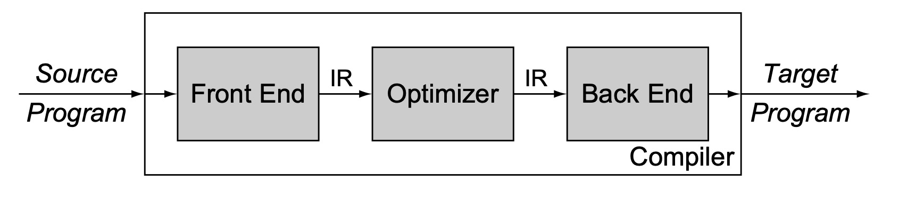
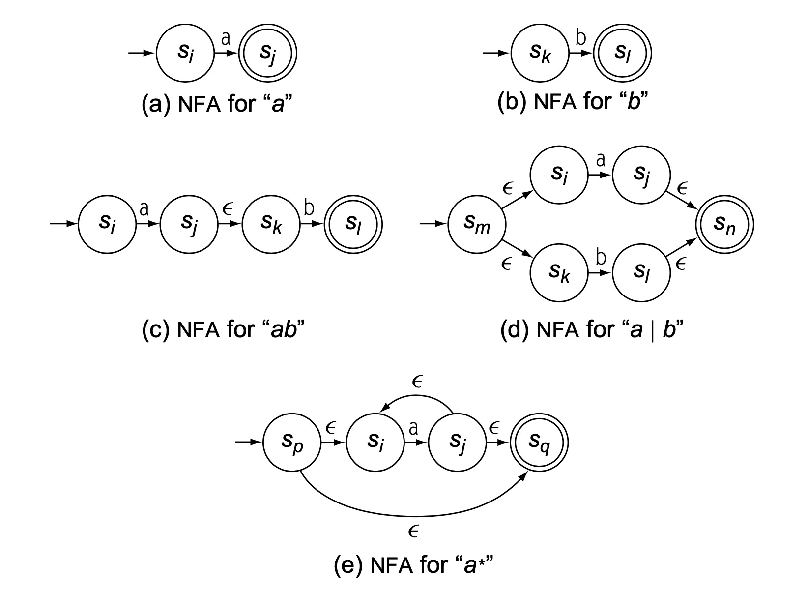
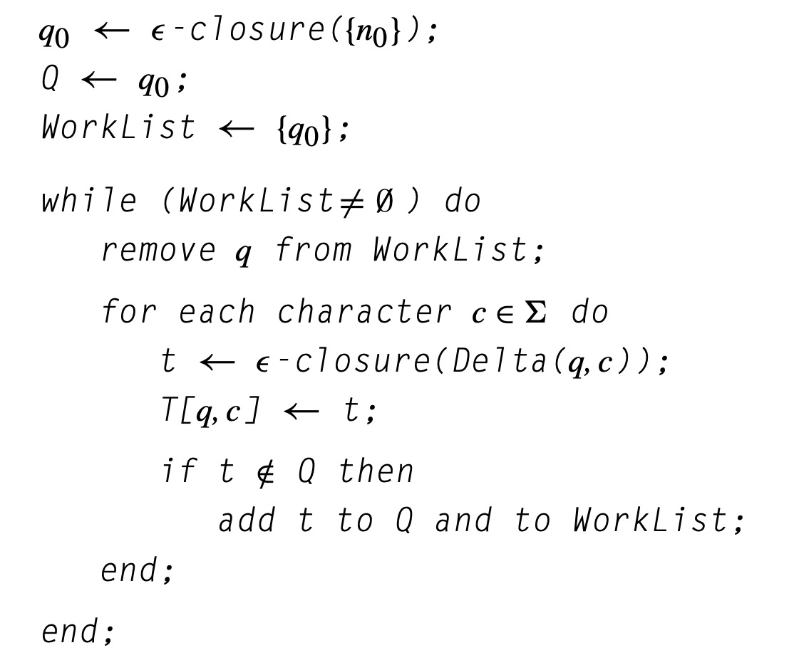
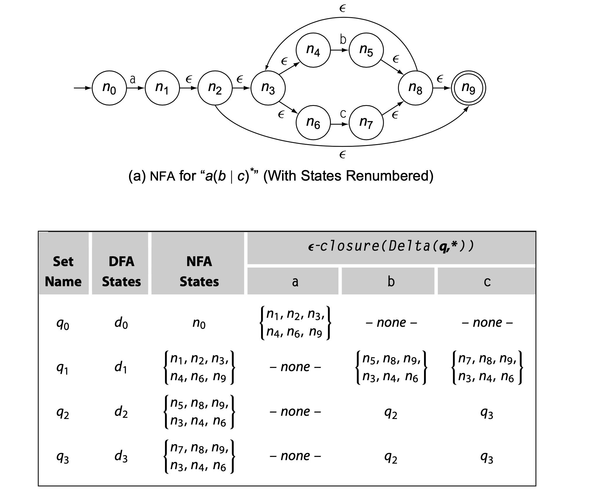
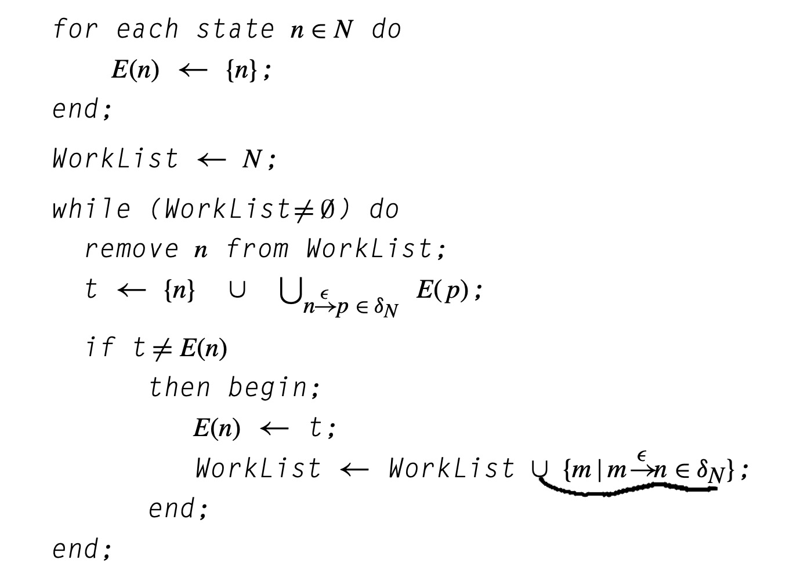
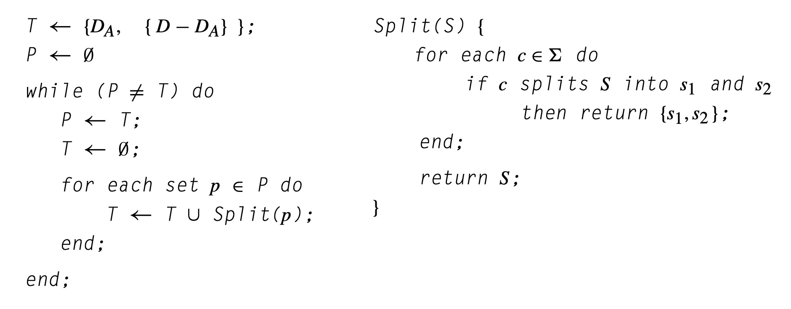
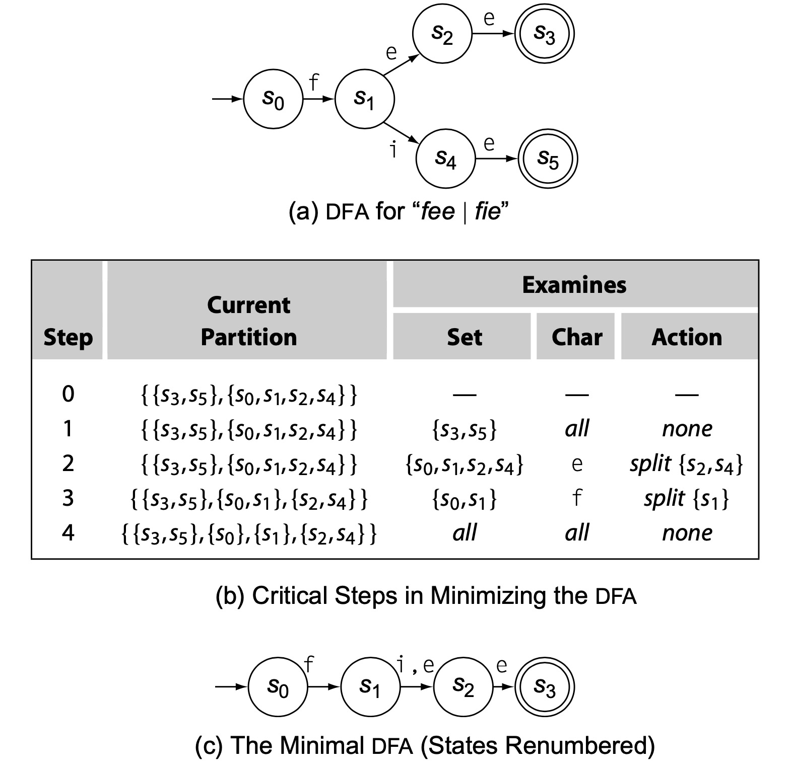
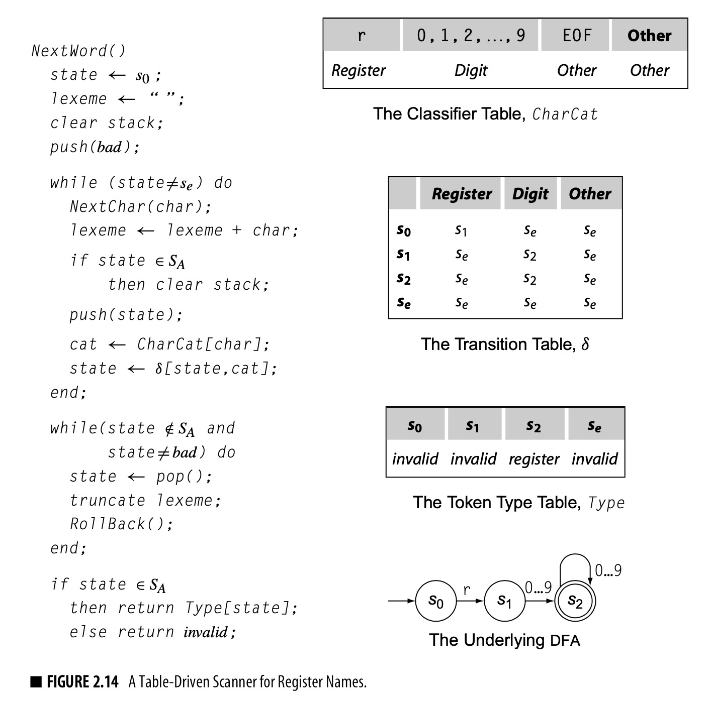
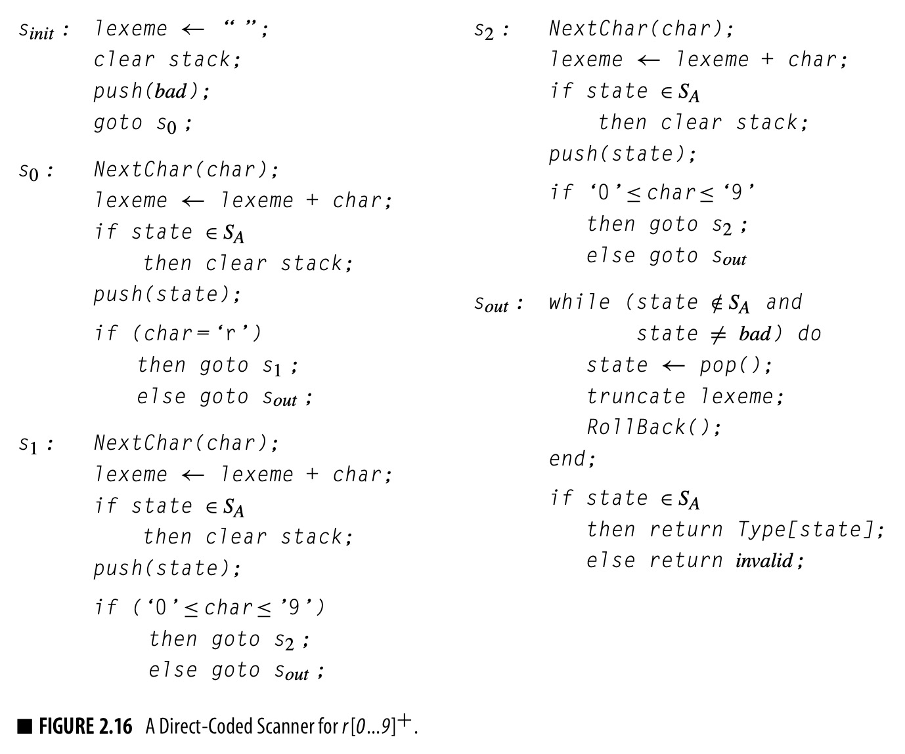

# Chap1 Overview of Compilation

编译器三部分：
* 前端。解析源程序，将语法分析结果转为IR。
* 优化器。接收IR作为输入，产出优化后的语义等价的IR。
* 后端。将IR映射到目标机器的有限资源。
    * Instruction Selection，例如将乘2转为add自身，少使用一个寄存器。
    * Register allocation
    * Instruction Scheduling，利用不同指令的执行时间不同进行合理调度。

# Chap2 Scanners
Scanner：解析输入文本流，输出单词及其语义类别。

FA五元组：
* S is the finite set of states in the recognizer, along with an error state se.
* Σ is the finite alphabet used by the recognizer. Typically, Σ is the union
of the edge labels in the transition diagram.
* δ(s, c) is the recognizer’s transition function. It maps each state s ∈ S and each character c ∈ Σ into some next state. In state si with input character c, the FA takes the transition si →c δ(si,c).
* s0 ∈ S is the designated start state.
* SA is the set of accepting states, SA ⊆ S. Each state in SA appears as a
double circle in the transition diagram.

RE的三个基本操作，并且封闭于下面的操作
* Alternation R|S
* Concatenation RS
* Kleene closure R*

FA与RE的等价性：可构建FA来识别RE，反之亦然。

RE在补集下封闭。

## 从RE到Scanner
### RE到NFA：Thompson’s Construction

Thompson’s construction得到的NFA的特点：
* 有一个开始状态和一个结束状态。
* 没有变换进入初始状态
* 没有变换离开结束状态
* ε变换连接更早的两个状态
* 每个状态至多有两个进入和两个离开的ε变换，对每个字符至多有一个进入和离开的变换。

### NFA到DFA：子集构建

* ε-closure examines each state si ∈ S and adds to S any
state reachable by following one or more ε-transitions from si
* Delta(q,c) that applies the nfa’s transition function to each element of q. It returns ∪s∈qi δN (s,c).

#### 离线计算ε-closure

### DFA to Minimal DFA: Hopcroft’s Algorithm

a symbol c ∈ Σ must produce the same behavior for every state di ∈ ps. If it does not, the algorithm splits ps around c.

For di and dj to remain together in ps, they must take equivalent transitions on each character c∈Σ.That is,∀c∈Σ,di→c dx and dj→c dy,wheredx,dy ∈pt

## 实现Scanner
* table-driven

* direct-coded

* hand-coded
